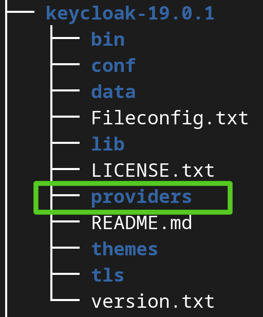
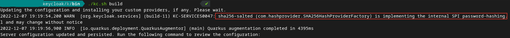
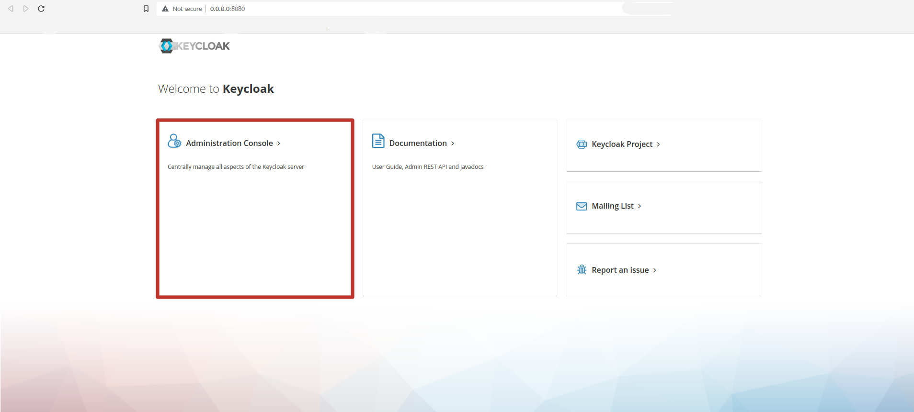

<h2>Building</h2>

Enter <code> mvn clean install</code>

JAR file is generated in ./target/SHA256_Hash_Provider_Keycloak-1.0-SNAPSHOT.jar

<h2>Use In Keycloak</h2>

Copy Jar file into <b>providers</b> directory in keycloak directory

And then go to the bin directory and enter <code>./kc.sh build</code> command

when build is complete you have to see this line:

Run keycloak server with this command for just Http:

<code>
./kc.sh start-dev --db-url-host 127.0.0.1 --db postgres --db-url-database keycloak --db-username postgres --db-password postgres 
--features=preview --features=declarative-user-profile --http-port=8080
</code>

Or you want to use from Https:

<code>
./kc.sh start-dev --https-certificate-file /keycloak-19.0.1/tls/localhost.pem --https-certificate-key-file /keycloak-19.0.1/tls/localhost-key.pem
--https-protocols TLSv1.3,TLSv1.2 --db-url-host 127.0.0.1 --db postgres --db-url-database keycloak --db-username postgres --db-password postgres
--features=preview --features=declarative-user-profile --http-port=8080 --https-port=8081
</code>

After that when you enter to [keycloak](http://0.0.0.0:8080) you have to see this console: 

if you register an admin before you can click on <b>Administration Console </b>and login to admin console
 but you have to enter a new username and password for create a new admin, and then you can to login 

